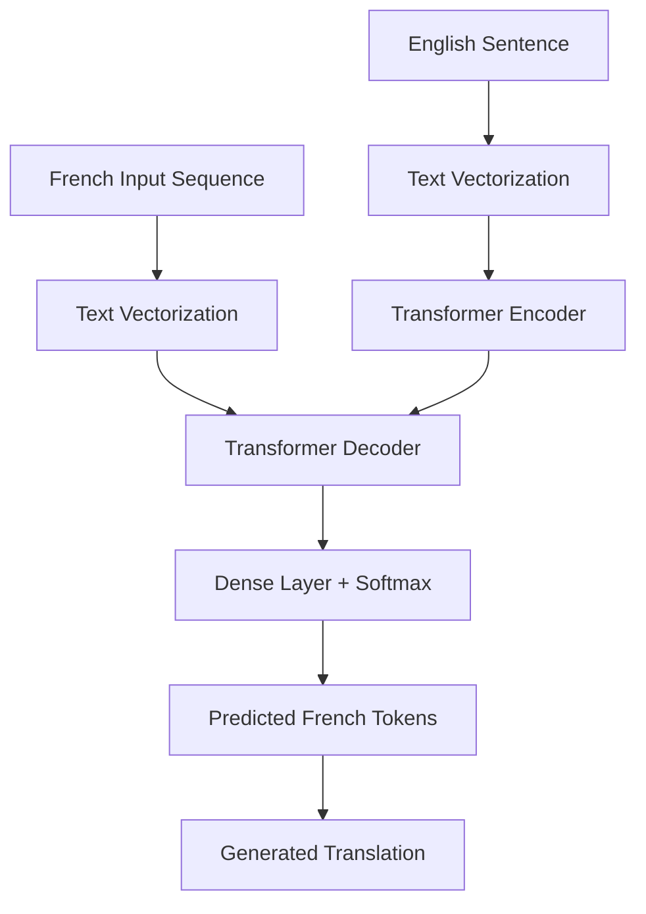
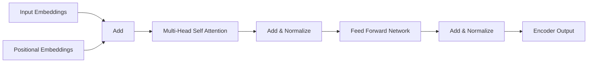
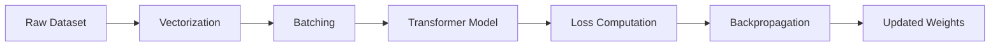

# Transformer From Scratch for Neural Machine Translation

A complete implementation of the Transformer architecture from scratch using TensorFlow/Keras for English-to-French machine translation.

This project reproduces the core ideas introduced in the paper **"Attention Is All You Need"** and demonstrates how modern sequence-to-sequence translation systems can be built using self-attention mechanisms instead of recurrent neural networks.

---

## Overview

This project implements:

* Data preprocessing and text vectorization
* Positional embeddings
* Multi-head self-attention
* Transformer encoder
* Transformer decoder
* Sequence masking
* Training pipeline
* Autoregressive inference
* English-to-French translation generation

The model learns to translate English sentences into French using a Transformer architecture built from fundamental TensorFlow/Keras components.

---

## Architecture



---

## Transformer Architecture



---

## Project Structure

```text
.
├── transformer-from-scratch.ipynb
├── README.md
├── data/
│   └── english_french_dataset.txt
├── models/
│   └── saved_transformer_model
└── outputs/
    └── sample_translations.txt
```

---

## Dataset

The model is trained on an English-French parallel corpus.

Example:

| English      | French               |
| ------------ | -------------------- |
| Hello        | Bonjour              |
| How are you? | Comment allez-vous ? |
| Thank you    | Merci                |
| Good morning | Bonjour              |

French sequences are augmented with special tokens:

```text
START_TOKEN
END_TOKEN
```

Example:

```text
English:
How are you?

French:
START_TOKEN Comment allez-vous ? END_TOKEN
```

---

## Components Implemented

### 1. Text Vectorization

Converts raw text into token IDs.

Features:

* Vocabulary generation
* Token indexing
* Sequence padding
* Batch processing

---

### 2. Positional Embedding Layer

Since Transformers do not process tokens sequentially, positional information is added to token embeddings.

Formula:

```text
Embedding = Token Embedding + Position Embedding
```

---

### 3. Multi-Head Attention

Allows the model to attend to multiple parts of a sentence simultaneously.

Benefits:

* Captures long-range dependencies
* Learns contextual relationships
* Improves translation quality

---

### 4. Transformer Encoder

Encoder block contains:

```text
Multi-Head Self Attention
        +
Residual Connection
        +
Layer Normalization
        +
Feed Forward Network
        +
Residual Connection
        +
Layer Normalization
```

Encoder processes English input sequences.

---

### 5. Transformer Decoder

Decoder contains:

```text
Masked Self Attention
        +
Cross Attention
        +
Feed Forward Network
```

Responsibilities:

* Prevent access to future tokens
* Attend to encoder outputs
* Generate translated text token by token

---

### 6. Causal Masking

Prevents information leakage during training.

Example:

```text
Input:
Je suis étudiant

Allowed Attention:

Je      -> Je
suis    -> Je, suis
étudiant -> Je, suis, étudiant
```

Future tokens remain hidden.

---

## Training Pipeline



---

## Model Configuration

Example configuration:

```python
VOCAB_SIZE = 15000
SEQUENCE_LENGTH = 20
EMBED_DIM = 256
LATENT_DIM = 2048
NUM_HEADS = 8
BATCH_SIZE = 64
EPOCHS = 20
```

Adjust according to your experiments.

---

## Training

Run the notebook:

```bash
jupyter notebook transformer-from-scratch.ipynb
```

or

```bash
jupyter lab
```

Execute all cells sequentially.

---

## Inference

Translation process:

1. Encode English sentence
2. Generate START_TOKEN
3. Predict next French token
4. Append prediction
5. Repeat until END_TOKEN

Example:

```text
Input:
I love machine learning.

Output:
J'aime l'apprentissage automatique.
```

---

## Sample Results

| English Input | Predicted Translation |
| ------------- | --------------------- |
| Hello         | Bonjour               |
| Thank you     | Merci                 |
| Good night    | Bonne nuit            |
| How are you?  | Comment allez-vous ?  |

---

## Evaluation Metrics

Potential evaluation metrics:

* BLEU Score
* Token Accuracy
* Cross Entropy Loss
* Validation Accuracy

---

## Requirements

```bash
pip install tensorflow
pip install numpy
pip install pandas
pip install matplotlib
pip install jupyter
```

or

```bash
pip install -r requirements.txt
```

---

## Future Improvements

* Beam Search Decoding
* Larger Transformer Models
* BLEU Score Evaluation
* Mixed Precision Training
* Transformer Base / Transformer Large
* Multi-GPU Training
* Custom Attention Visualization
* Support for Multiple Languages

---

## Learning Objectives

This project demonstrates:

* Neural Machine Translation
* Self-Attention Mechanisms
* Multi-Head Attention
* Encoder-Decoder Architectures
* Sequence Modeling
* Deep Learning with TensorFlow
* Transformer Internals

---

## References

### Attention Is All You Need

Vaswani et al., 2017

```bibtex
@article{vaswani2017attention,
  title={Attention Is All You Need},
  author={Vaswani, Ashish and others},
  journal={NeurIPS},
  year={2017}
}
```

---

## Author

Yash Tripathi

Built as a learning project to understand and implement Transformer architectures from scratch using TensorFlow and Keras.
